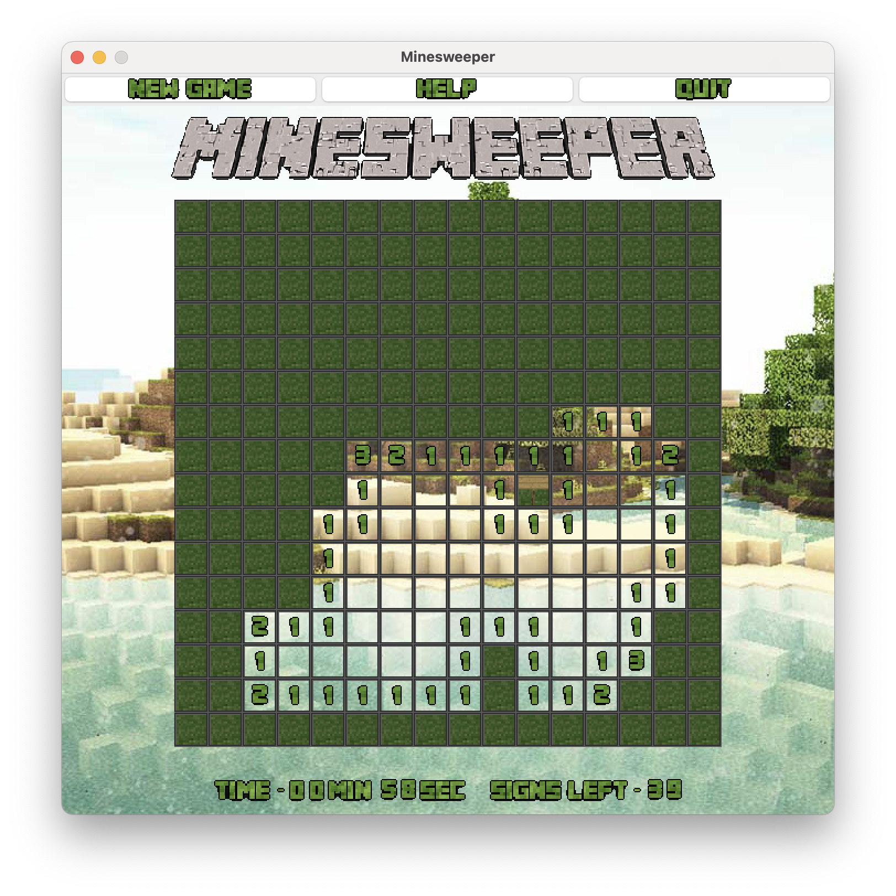

# Minesweeper

Minesweeper clone made for a Computer Science Assignment.

It was made using Java and it took one week to complete.

It is minecraft themed which is why the "mines" are creepers, the "flags" are
signposts and the blocks that are uncovered use a grass texture
from a minecraft papercraft net.

## Build

1. `make` to compile the Java files
2. `make jar` to build the `jar` file to `./jar/Minesweeper.jar`

## Run

1. `make jar` to build the `jar` executable
2. `make run-jar` or `java -jar ./jar/Minesweeper.jar` to run the game

## References

* Text images were made using: [textcraft.net](http://textcraft.net/)
* Font used to create the logo is "Minecrafter V3"
by "Asherz08", "MadPixel", "Ashley Denham"
